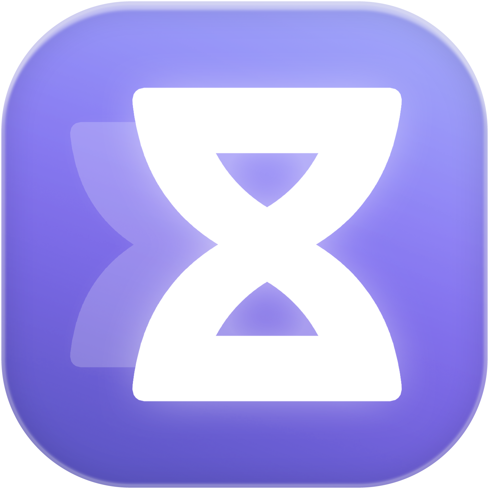

<h1 align="center">QuotaGrain for Codex</h1>

<strong>Multiple Codex accounts. Your quota at a glance.</strong>

English · <a href="README.zh-CN.md">中文</a>

  
  
  

<a href="https://seanye73.github.io/QuotaGrain-for-Codex/">Website</a> · <a href="#see-your-accounts-in-one-place">Features</a> · <a href="#install">Install</a> · <a href="#your-data">Privacy</a> · <a href="#support">Support &amp; unlock</a> · <a href="#feedback">Feedback</a>

---

## See your accounts in one place

  

For independent developers and studios working with multiple Codex accounts, QuotaGrain for Codex brings quota and reset times into one panel on your Mac. See which accounts have quota available and open the client you need, without checking each account separately.

- **Quota and reset times.** See remaining percentages, quota windows, reset times, and account errors in one panel.
- **Separate Codex clients.** Add, name, reorder, and open accounts with their own settings and session data. Keep multiple clients running side by side, including those configured for external APIs or local models.
- **Cloud APIs and local models.** Set an external API endpoint and model for its Codex client, and view locally recorded token totals.
- **Automatic refresh and alerts.** Refresh automatically, receive optional low-quota alerts, or refresh on demand.
- **An appearance that fits.** Use a light or dark appearance, or follow your Mac’s system setting. The interface follows your system language by default, with English and Chinese options. Choose a single-column or two-column panel.

External services must support **OpenAI Responses**. External API token totals come from local usage records and do not represent provider balances or remaining quota.

## More accounts at a glance

  

## Requirements and compatibility

- Apple Silicon Mac
- macOS 13 or later
- Codex installed for account sign-in and client launching

Use **Check for updates** in the app to look for a newer version. When one is available, open its GitHub download page and install the update manually.

The workflow is straightforward: add an account → sign in or configure an external API → check quota or token usage → open Codex from the account card. QuotaGrain for Codex runs with its own app, process, and menu bar icon.

QuotaGrain for Codex relies on existing Codex and macOS mechanisms. Upstream changes or restrictions may make some features unavailable. Future versions and system compatibility depend on actual releases.

QuotaGrain for Codex is distributed as a Developer ID-signed Mac app that has passed Apple notarization and Gatekeeper verification.

## Install

1. Download the DMG from [GitHub Releases](https://github.com/seanye73/QuotaGrain-for-Codex/releases/latest).
2. Open it and drag **QuotaGrain for Codex** into **Applications**.
3. Open the app from Applications, then eject the installation disk.

## Your data

### Stored on your Mac

Account registrations, settings, quota snapshots, and token totals stay on your Mac. Each account created through QuotaGrain for Codex has a separate directory under `~/.codex/accounts/`:

- **Account data.** Each directory holds that account’s configuration, authentication information, and session data.
- **Desktop client data.** Each client stores its data in the account directory’s `desktop/` subfolder.

Your existing default account data in `~/.codex` stays unchanged.

### Connections to your services

Quota checks send the necessary authentication information to ChatGPT in read-only requests. API model discovery and connection checks contact the provider you configure. Connection checks may make small test requests that incur provider charges.

Account credentials are not sent to the developer or written to usage logs.

[Learn more on the website](https://seanye73.github.io/QuotaGrain-for-Codex/#support)

## Frequently asked questions

### Can I run multiple Codex desktop clients at the same time?

Yes. Open a separate Codex desktop client from each account card and use them side by side. Each account has its own configuration, authentication information, and session data.

### Can I use external APIs or local models?

Yes. Configure a service endpoint and model for an external API account, then open its Codex client. The service must support OpenAI Responses. Local token totals show recorded usage, not provider balances, remaining quota, or billed amounts.

## Feedback

For help or feedback, [email x73.sean.ye@outlook.com](mailto:x73.sean.ye@outlook.com) with a brief description of what happened, your current app version (including the build number shown in About), and any relevant screenshots or supporting documents.

QuotaGrain for Codex is an independently developed third-party tool. Codex, ChatGPT, and other product names are trademarks of their respective owners.
