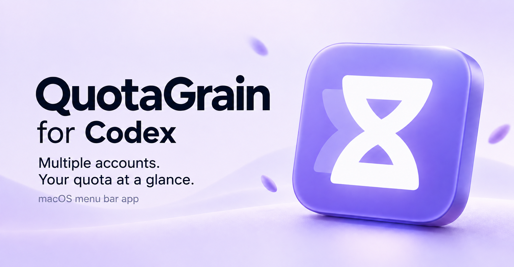

# QuotaGrain for Codex

**Multiple Codex accounts. Your quota at a glance.**

QuotaGrain for Codex is a macOS menu bar app for monitoring quota across multiple Codex accounts and running their desktop clients side by side. It also supports external APIs and local models through Responses-compatible services, with locally recorded token usage.

[Privacy](SECURITY.md) · [Terms](TERMS.md) · [Download for Mac](https://github.com/seanye73/QuotaGrain-for-Codex/releases/latest) · [Support & unlock](#support) · [中文介绍](#chinese)

  

## See your accounts in one place

  

[View app screenshot](assets/quotagrain-overview-light-en.png)

For independent developers and studios working with multiple Codex accounts, QuotaGrain for Codex brings quota and reset times into one panel on your Mac. See which accounts have quota available and open the client you need, without checking each account separately.

- **Quota and reset times.** See remaining percentages, quota windows, reset times, and account errors in one panel.
- **Separate Codex clients.** Add, name, reorder, and open accounts with their own settings and session data. Keep multiple clients running side by side, including those configured for external APIs or local models.
- **Cloud APIs and local models.** Set an external API endpoint and model for its Codex client, and view locally recorded token totals.
- **Automatic refresh and alerts.** Refresh automatically, receive optional low-quota alerts, or refresh on demand.
- **An appearance that fits.** Use a light or dark appearance, or follow your Mac’s system setting. The interface follows your system language by default, with English and Chinese options. Choose a single-column or two-column panel.

External services must support **OpenAI Responses**. External API token totals come from local usage records and do not represent provider balances or remaining quota.

## Requirements and compatibility

- Apple Silicon Mac
- macOS 13 or later
- Codex installed for account sign-in and client launching

Use **Check for updates** in the app to look for a newer version. When one is available, open its GitHub download page and install the update manually.

The workflow is straightforward: add an account → sign in or configure an external API → check quota or token usage → open Codex from the account card. QuotaGrain for Codex runs with its own app, process, and menu bar icon.

QuotaGrain for Codex relies on existing Codex and macOS mechanisms. Upstream changes or restrictions may make some features unavailable. Future versions and system compatibility depend on actual releases.

QuotaGrain for Codex is distributed as a Developer ID-signed Mac app that has passed Apple notarization and Gatekeeper verification.

## Install

1. Download the DMG from [GitHub Releases](https://github.com/seanye73/QuotaGrain-for-Codex/releases/latest).
2. Open it and drag **QuotaGrain for Codex** into **Applications**.
3. Open the app from Applications, then eject the installation disk.

## Your data

### Stored on your Mac

Account registrations, settings, quota snapshots, and token totals stay on your Mac. Each account created through QuotaGrain for Codex has a separate directory under `~/.codex/accounts/`:

- **Account data.** Each directory holds that account’s configuration, authentication information, and session data.
- **Desktop client data.** Each client stores its data in the account directory’s `desktop/` subfolder.

Your existing default account data in `~/.codex` stays unchanged.

### Connections to your services

Quota checks send the necessary authentication information to ChatGPT in read-only requests. API model discovery and connection checks contact the provider you configure. Connection checks may make small test requests that incur provider charges.

Account credentials are not sent to the developer or written to usage logs.

## Support the project

QuotaGrain for Codex is free for up to two accounts. If you need more, you can support its development to unlock unlimited accounts.

Listed price: **US$9.99**, one-time purchase. Each key permits cumulative activation on up to two Macs; deactivation does not reset the total and device replacement support is not included. See the [usage and purchase terms](TERMS.md).

[Contact the developer](mailto:x73.sean.ye@outlook.com)

## Frequently asked questions

### Can I run multiple Codex desktop clients at the same time?

Yes. Open a separate Codex desktop client from each account card and use them side by side. Each account has its own configuration, authentication information, and session data.

### Can I use external APIs or local models?

Yes. Configure a service endpoint and model for an external API account, then open its Codex client. The service must support OpenAI Responses. Local token totals show recorded usage, not provider balances, remaining quota, or billed amounts.

### What does supporting the developer unlock?

Support unlocks the number of accounts you can manage in QuotaGrain for Codex. Both Codex and external API accounts count toward the free limit of two. Automatic refresh, quota alerts, and privacy protections are the same. Unlocking does not increase quota from OpenAI or your API provider.

## Feedback

For help or feedback, [email x73.sean.ye@outlook.com](mailto:x73.sean.ye@outlook.com) with a brief description of what happened, your current app version (including the build number shown in About), and any relevant screenshots or supporting documents.

QuotaGrain for Codex is an independently developed third-party tool. It is not affiliated with, partnered with, or endorsed by OpenAI. Codex, ChatGPT, and other product names are trademarks of their respective owners.

---

## 中文介绍

[隐私说明](SECURITY.md) · [使用条款](TERMS.md) · [下载 Mac 版](https://github.com/seanye73/QuotaGrain-for-Codex/releases/latest) · [Read in English](#english)

**多个 Codex 账号，额度一眼看清。**

QuotaGrain for Codex 是独立的 macOS 菜单栏工具，集中展示账号额度、重置时间和异常状态，并从账号卡片打开各自独立的 Codex 客户端。支持外部 API 与本地模型、本地累计 Token 统计、自动刷新、额度提醒，以及中英文和单栏、双栏布局。

外部服务需要兼容 **OpenAI Responses** 接口；本地 Token 汇总是用量记录，不代表服务商余额或剩余额度。

运行环境为 Apple Silicon Mac、macOS 13 或更高版本，并需安装 Codex 以登录和打开客户端。后续版本与系统兼容性以实际发行情况为准。

安装：从下载页获取 DMG，打开后将 **QuotaGrain for Codex** 拖进 **Applications（应用程序）**，从应用程序打开，再推出安装磁盘。界面语言首次默认跟随系统，也可在设置中选择中文或英文。

账号登记、设置、额度快照和 Token 汇总保存在本机。额度查询访问 ChatGPT，外部 API 的模型发现和连接检查访问你指定的服务商；必要的连接测试可能产生服务商费用。账号凭据不发送给作者，也不写入用量日志。

通过我们的软件新建的独立账号保存在你 Mac 的 `~/.codex/accounts/` 目录下。每个账号各有自己的配置、认证信息和会话数据，客户端数据保存在该账号目录下的 `desktop/` 中。原有 `~/.codex` 中的默认账号数据保持原样。

QuotaGrain for Codex 依赖 Codex 与 macOS 的现有机制。上游变更或限制可能导致部分功能不可用。

## 支持这个项目

QuotaGrain for Codex 可免费管理 2 个账号。如果你需要管理更多账号，欢迎支持项目开发并解锁不限账号。

标价 **US$9.99，一次性购买**。每码最多累计激活两台 Mac；取消激活不重置累计数量，购买不包含换机支持。详见[使用与购买条款](TERMS.md)。

[联系作者](mailto:x73.sean.ye@outlook.com)

## 问题反馈与联系

有问题或建议，欢迎[通过邮箱联系作者](mailto:x73.sean.ye@outlook.com)，请简要说明问题发生的情况、当前 App 版本（含“关于”页面中的构建号），并附上相关截图或凭证，方便排查处理。

QuotaGrain for Codex 是独立开发的第三方工具，与 OpenAI 无隶属或合作关系，也未获得其认可或背书。相关产品名称的商标归各自权利人所有。
